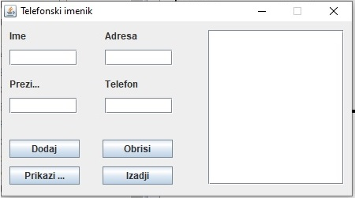

# Predavanje 12

	14 Grafičku (korisnički) interfejsi u Javi

# Zadatak 1

Napraviti javnu klasu **Osoba** u paketu **dvocas12_utorak.zadatak1.poslovna_logika** koja ima:

- privatni atribut **ime** koji predstavlja ime osobe.
- privatni atribut **prezime** koji predstavlja prezime osobe.
- privatni atribut **adresa** koji predstavlja adresu stanovanja osobe.
- privatni atribut **telefon** koji predstavlja telefon osobe kao ceo broj.

- javne **get i set metode** za ve ove atribute. Atributi imePrezime i adresa ne smeju biti null niti prazni stringovi. Telefon mora biti broj veći od nule. U slučaju pokušaja unosa nedozvoljenih vrednosti baciti izuzetak sa odgovarajućom porukom.
- redefinisanu javnu **toString** metodu koja vraća String sa svim podacima o Osobi.
- redefinisanu javnu **equals** metodu koja poredi dva objekta klase Osoba i vraća true ako su im isti ime i prezime, a false ako nisu.

**(GUI u Javi, AWT, Swing i Java FX biblioteke)**

**Problem**: postoji više načina da se napravi GUI u Javi i više biblioteka. Jedan način je da se koriste gotove klase i kod kuca u običnom Java editoru. Međutim, mnogo je bolja opcija da se koristi grafički (vizuelni) editor koji omogućava da se mišem dizajnira GUI, a da on automatski generiše odgovarajući kod. Za Eclipse okruženje to je Window Builder.

Napraviti javnu klasu **ImenikGUI** u paketu **dvocas12_utorak.zadatak1.gui** koja izgleda kao na slici. Namestiti da dimenzije prozora ne mogu da se menjaju.**(Instalacija WindowBuilder-a, osnovni izgled grafičkog editora, source i design pregled, osnovne klase u Swing biblioteci i njihovi atributi: JFrame, JButton, JLabel, JTextField, JtextArea, JScrollPane...)**

Klasa **ImenikGUI** bi trebalo da ima: 

- privatni atribut **osobe** koji predstavlja listu objekata klase Osoba. Listu odmah inicijalizovati kao ArrayList.

- kada se klikne na dugme **Izadji**, trebalo bi da se cela aplikacija isključi. **(GUI reaguje na događaje, event handler-i se vezuju za događaj i grafičku komponentu)**

- kada se klikne na dugme **Obrisi**, trebalo bi da se izbrišu sadržaji svih polja za unos i polja za ispis (editor na desnoj strani).

- kada se klikne na dugme **Dodaj**, trebalo bi da se preuzmu podaci iz polja za unos imena, prezimena, adrese i telefona. Onda bi trebalo napraviti nov objeka klase Osoba, napuniti ga ovim podacima, i uneti u listu **osobe**. U slučaju da je nastala neka greška (bačen izuzetak), prikazati dodatni prozor u kojem se ispisuje poruka greške. **(Obrada izuzetaka u GUI-ju, dve radne niti, polu-gotovi prozori - klasa JOptionPane)**

- kada se klikne na dugme **Prikazi**, potrebno je ispisati sve podatke o svim osobama iz liste u editor koji se nalazi na desnoj strani ekrana.